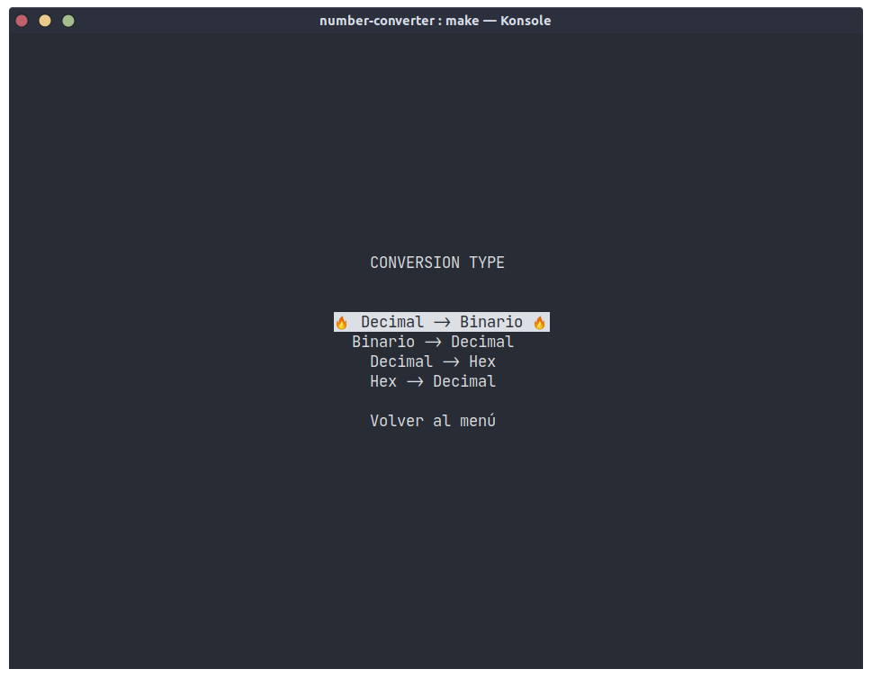
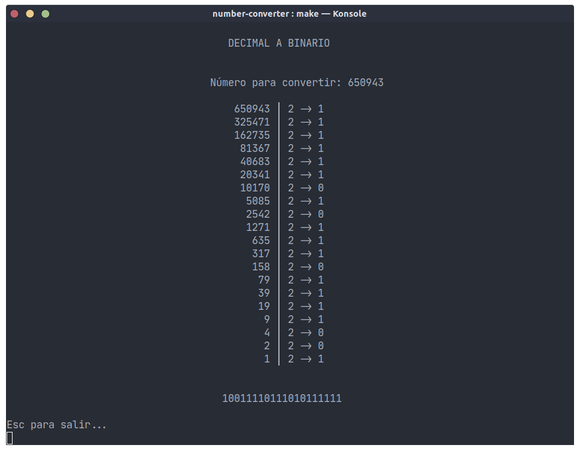
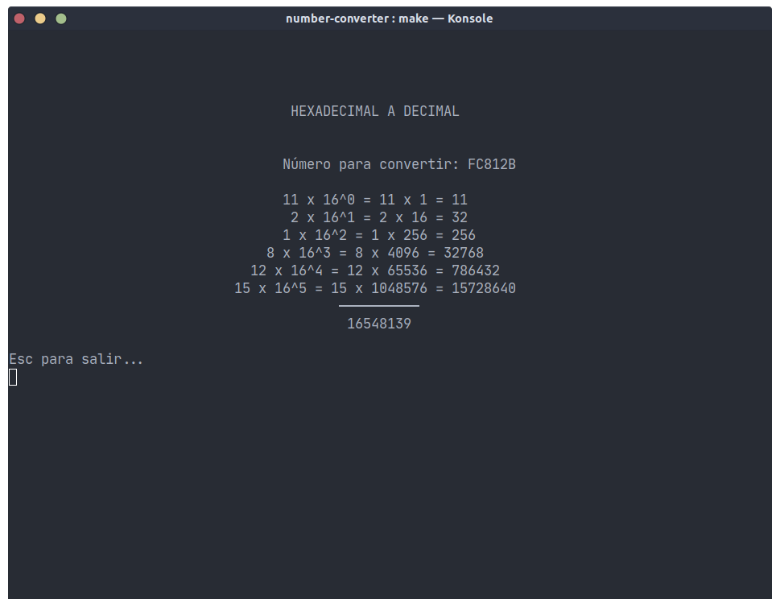

# Bytes
## Number base converter.
Convert a the base of a number to another without having to worry about the process, 'cuz it'll do for you.

---

### **Conversions**

#### **Decimal to binary**

#### **Hex to decimal**

